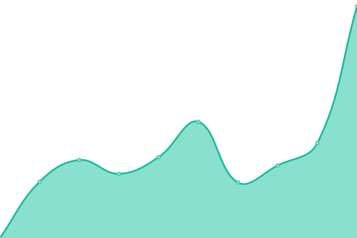
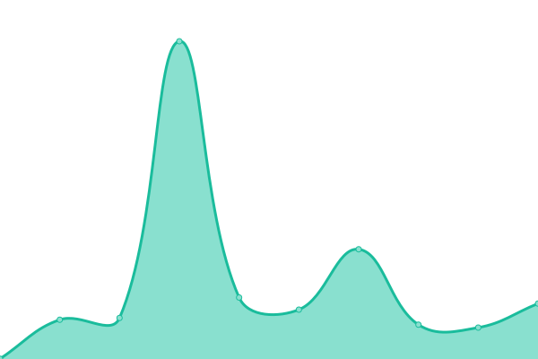
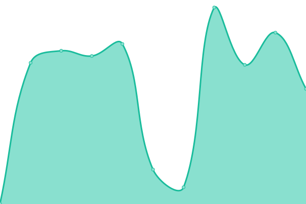
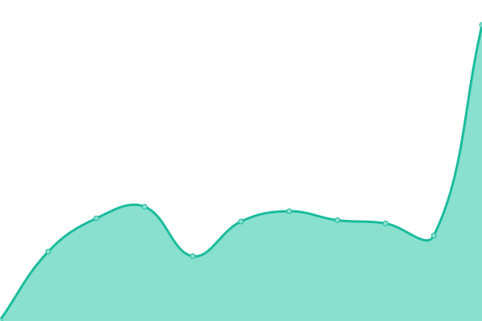

# [📈 Live Status](https://demo.upptime.js.org): <!--live status--> **🟨 Partial outage**

This repository contains the open-source uptime monitor and status page for [Upptime](https://upptime.js.org), powered by [Upptime](https://github.com/upptime/upptime).

With [Upptime](https://upptime.js.org), you can get your own unlimited and free uptime monitor and status page, powered entirely by a GitHub repository. We use [Issues](https://github.com/upptime/upptime/issues) as incident reports, [Actions](https://github.com/upptime/upptime/actions) as uptime monitors, and [Pages](https://demo.upptime.js.org) for the status page.

<!--start: status pages-->
<!-- This summary is generated by Upptime (https://github.com/upptime/upptime) -->
<!-- Do not edit this manually, your changes will be overwritten -->

| URL                                                 | Status  | History                                                                                               | Response Time                                                                         | Uptime                                                                                                                                                                                                                    |
| --------------------------------------------------- | ------- | ----------------------------------------------------------------------------------------------------- | ------------------------------------------------------------------------------------- | ------------------------------------------------------------------------------------------------------------------------------------------------------------------------------------------------------------------------- |
| [Library Website](https://library.princeton.edu)    | 🟩 Up   | [library-website.yml](https://github.com/pulibrary/uptime/commits/master/history/library-website.yml) |  127ms  |  |
| [Library Catalog](https://catalog.princeton.edu)    | 🟩 Up   | [library-catalog.yml](https://github.com/pulibrary/uptime/commits/master/history/library-catalog.yml) |  1566ms |  |
| [Maps Website](https://maps.princeton.edu)          | 🟩 Up   | [maps-website.yml](https://github.com/pulibrary/uptime/commits/master/history/maps-website.yml)       |  247ms     |        |
| [Figgy](https://figgy.princeton.edu)                | 🟩 Up   | [figgy.yml](https://github.com/pulibrary/uptime/commits/master/history/figgy.yml)                     |  1092ms           |                      |
| [Research Data](https://researchdata.princeton.edu) | 🟩 Up   | [research-data.yml](https://github.com/pulibrary/uptime/commits/master/history/research-data.yml)     |  234ms    |      |
| Secret Site                                         | 🟥 Down | [secret-site.yml](https://github.com/pulibrary/uptime/commits/master/history/secret-site.yml)         |  0ms        |           |

<!--end: status pages-->

[**Visit our status website →**](https://demo.upptime.js.org)

## 📄 License

- Code: [MIT](./LICENSE) © [Upptime](https://upptime.js.org)
- Data in the `./history` directory: [Open Database License](https://opendatacommons.org/licenses/odbl/1-0/)
