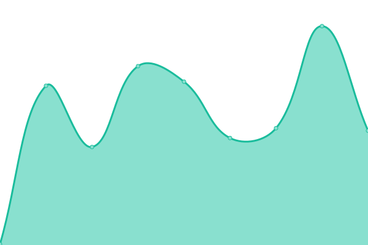

# [📈 Live Status](https://demo.upptime.js.org): <!--live status--> **🟧 Partial outage**

This repository contains the open-source uptime monitor and status page for [Upptime](https://upptime.js.org), powered by [Upptime](https://github.com/upptime/upptime).

With [Upptime](https://upptime.js.org), you can get your own unlimited and free uptime monitor and status page, powered entirely by a GitHub repository. We use [Issues](https://github.com/upptime/upptime/issues) as incident reports, [Actions](https://github.com/upptime/upptime/actions) as uptime monitors, and [Pages](https://demo.upptime.js.org) for the status page.

<!--start: status pages-->
<!-- This summary is generated by Upptime (https://github.com/upptime/upptime) -->
<!-- Do not edit this manually, your changes will be overwritten -->
<!-- prettier-ignore -->
| URL | Status | History | Response Time | Uptime |
| --- | ------ | ------- | ------------- | ------ |
|  [Library Website](https://library.princeton.edu) | 🟩 Up | [library-website.yml](https://github.com/pulibrary/uptime/commits/master/history/library-website.yml) | 

 223ms
     
 | 

<a href="https://pulibrary.github.io/history/library-website">100.00%</a>
    

|  [Library Catalog](https://catalog.princeton.edu) | 🟩 Up | [library-catalog.yml](https://github.com/pulibrary/uptime/commits/master/history/library-catalog.yml) | 

 3587ms
     
 | 

<a href="https://pulibrary.github.io/history/library-catalog">99.61%</a>
    

|  [Maps Website](https://maps.princeton.edu) | 🟩 Up | [maps-website.yml](https://github.com/pulibrary/uptime/commits/master/history/maps-website.yml) | 

 214ms
     
 | 

<a href="https://pulibrary.github.io/history/maps-website">100.00%</a>
    

|  [Figgy](https://figgy.princeton.edu) | 🟩 Up | [figgy.yml](https://github.com/pulibrary/uptime/commits/master/history/figgy.yml) | 

 712ms
     
 | 

<a href="https://pulibrary.github.io/history/figgy">100.00%</a>
    

|  [Research Data](https://researchdata.princeton.edu) | 🟩 Up | [research-data.yml](https://github.com/pulibrary/uptime/commits/master/history/research-data.yml) | 

 660ms
     
 | 

<a href="https://pulibrary.github.io/history/research-data">100.00%</a>
    

|  [Cicognara](https://cicognara.org) | 🟩 Up | [cicognara.yml](https://github.com/pulibrary/uptime/commits/master/history/cicognara.yml) | 

 293ms
     
 | 

<a href="https://pulibrary.github.io/history/cicognara">100.00%</a>
    

|  [DPUL](https://dpul.princeton.edu) | 🟩 Up | [dpul.yml](https://github.com/pulibrary/uptime/commits/master/history/dpul.yml) | 

 273ms
     
 | 

<a href="https://pulibrary.github.io/history/dpul">100.00%</a>
    

|  [Dataspace](https://dataspace.princeton.edu) | 🟩 Up | [dataspace.yml](https://github.com/pulibrary/uptime/commits/master/history/dataspace.yml) | 

 132ms
     
 | 

<a href="https://pulibrary.github.io/history/dataspace">100.00%</a>
    

|  [OAR](https://oar.princeton.edu) | 🟩 Up | [oar.yml](https://github.com/pulibrary/uptime/commits/master/history/oar.yml) | 

 153ms
     
 | 

<a href="https://pulibrary.github.io/history/oar">99.80%</a>
    

|  [Bibdata](https://bibdata.princeton.edu) | 🟩 Up | [bibdata.yml](https://github.com/pulibrary/uptime/commits/master/history/bibdata.yml) | 

 137ms
     
 | 

<a href="https://pulibrary.github.io/history/bibdata">100.00%</a>
    

|  [Confluence](https://lib-confluence.princeton.edu) | 🟩 Up | [confluence.yml](https://github.com/pulibrary/uptime/commits/master/history/confluence.yml) | 

 223ms
     
 | 

<a href="https://pulibrary.github.io/history/confluence">96.38%</a>
    

|  Secret Site | 🟥 Down | [secret-site.yml](https://github.com/pulibrary/uptime/commits/master/history/secret-site.yml) | 

 0ms
     
 | 

<a href="https://pulibrary.github.io/history/secret-site">0.00%</a>
    

<!--end: status pages-->

[**Visit our status website →**](https://demo.upptime.js.org)

## 📄 License

- Code: [MIT](./LICENSE) © [Upptime](https://upptime.js.org)
- Data in the `./history` directory: [Open Database License](https://opendatacommons.org/licenses/odbl/1-0/)
